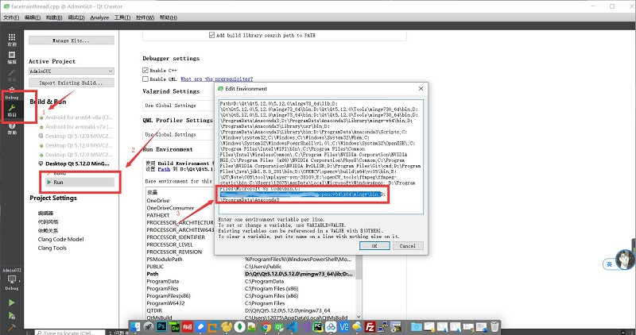

# 人脸识别考勤系统
## 开发环境
- Qt5.12
- QtCreator
- Windows10
- opncv3.4.4
- opencv_contrib-3.4.4

## 使用说明
- 在运行之前需要配置一下opencv的运行环境

- 在QtCreator中直接运行就行了

## 功能描述
### 三个功能界面
1) 考勤界面
   - 使用opencv_conreib库读取训练好的数据文件
   - 打开摄像头获取用户的脸部信息
   - 实时获取脸部数据信息得到标签号，在训练好的数据中进行查找
   - 识别成功则打卡
   - 每天只有一个人只能打卡
2) 管理员界面
   - 有增删改查和录入人脸信息的功能
   - 还可以训练人脸信息
3) 查询界面
   - 查询打开表格

